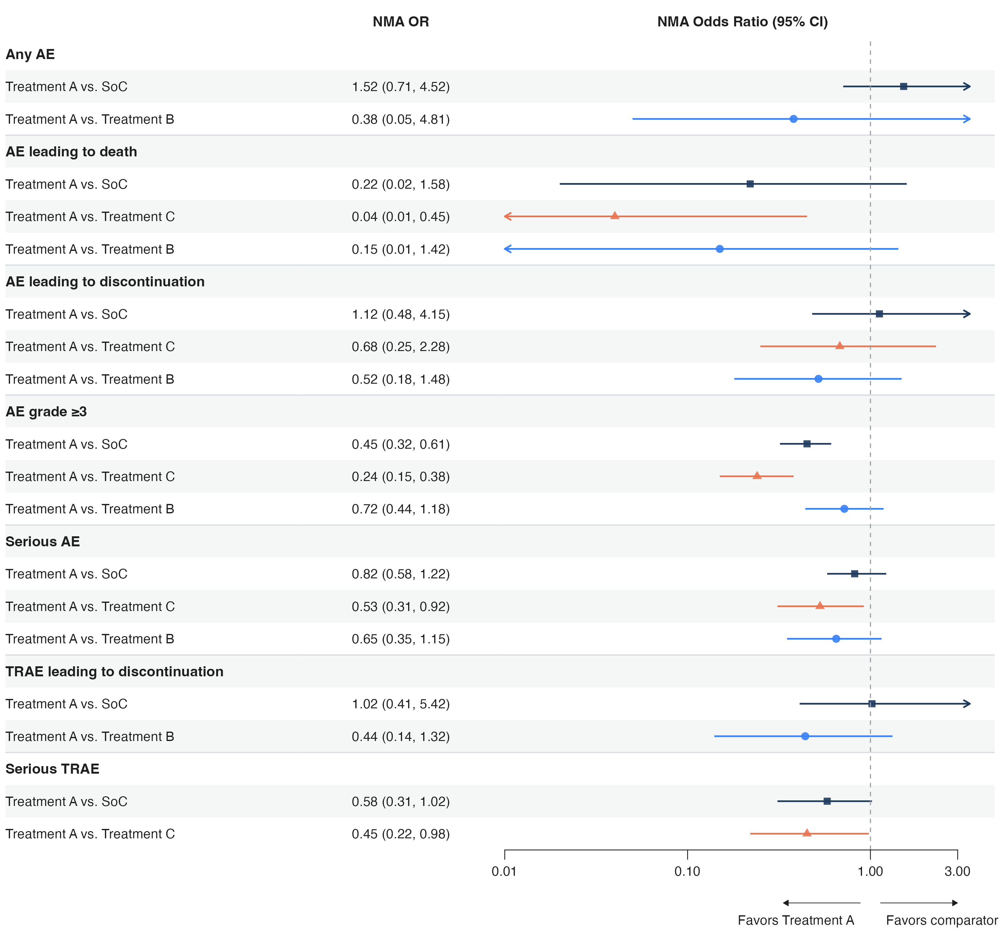

# panelforest

[中文文档](README.zh.md)

`panelforest` is an R package for building tidy-style forest plots with declarative layouts, modular panels, and patchwork-based rendering.



## Installation

From a local checkout:

```r
install.packages(".", repos = NULL, type = "source")
```

Or install from GitHub:

```r
# install.packages("pak")
pak::pak("lenardar/panelforest")
```

## Features

- Pipe-style composition via `forest_plot()` and `add_*()`
- Built-in panels: `fp_text()`, `fp_text_ci()`, `fp_gap()`, `fp_spacer()`, `fp_bar()`, `fp_dot()`, `fp_ci()`
- Row stripes, summary rows, group-title rows, and horizontal separators
- Spanning parent headers via `add_header_group()` with automatic multi-level nesting
- Column-driven aesthetic mappings via `fp_aes()` and unified cell/row editing via `edit()`
- Conditional row styling via `add_rule()` — highlight rows by data conditions without manual index lookups
- Diamond CI glyphs with independent border colour, fill colour, and transparency
- Custom panels via `fp_custom()`
- Formatting helpers: `fp_fmt_number()`, `fp_fmt_percent()`, `fp_fmt_pvalue()`

## Quick Start

```r
library(panelforest)

df <- panelforest_example_data()

forest_plot(df) |>
  add_stripe(c("white", "#f4f7f5")) |>
  add_summary(1) |>
  add_hline(1) |>
  add_text("label", header = "Subgroup", width = 2.5, align = "left", header_align = "center") |>
  add_bar("n_events", header = "Events", width = 2) |>
  add_ci("HR", "LCI", "UCI", header = "Hazard Ratio", trans = "log", width = 3) |>
  add_text_ci("HR", "LCI", "UCI", header = "HR (95% CI)", width = 2.5, align = "left", header_align = "center") |>
  fp_render()
```

## Mapped Aesthetics via `fp_aes()`

```r
df$ci_colour <- c("#111827", "#1d4ed8", "#1d4ed8", "#111827", "#b42318")
df$ci_fill <- c("#d1d5db", "#bfdbfe", "#bfdbfe", "#d1d5db", "#fecaca")
df$ci_shape <- c(18, 19, 19, 19, 17)

forest_plot(df) |>
  add_text("label", header = "Subgroup", align = "left", header_align = "center") |>
  add_ci("HR", "LCI", "UCI", header = "Hazard Ratio", trans = "log",
         mapping = fp_aes(colour = "ci_colour", fill = "ci_fill", shape = "ci_shape")) |>
  edit(row = 1, panel = "Hazard Ratio", glyph = "diamond", fill = "#dbeafe") |>
  edit(row = 5, panel = "Hazard Ratio", point_size = 3.4) |>
  fp_render()
```

## Unified `edit()` Layer

The `edit()` function replaces the old `edit_cell()`, `add_row_style()`, and `add_row_height()`:

```r
forest_plot(df) |>
  add_text("label", header = "Subgroup") |>
  add_ci("HR", "LCI", "UCI", header = "HR") |>
  # Cell-level edit (panel specified)
  edit(row = 1, panel = "HR", glyph = "diamond", fill = "#dbeafe") |>
  # Row-level edit (no panel)
  edit(row = 2:4, fontface = "italic") |>
  # Height edit
  edit(row = 5, height = 1.5) |>
  fp_render()
```

Rows marked with `add_summary()` render as CI diamonds by default. Use `summary_glyph = NULL` to keep the standard point-and-line glyph.

## Conditional Styling — `add_rule()`

`add_rule()` applies styles to rows that satisfy a data condition, evaluated at render time. This is the declarative alternative to looking up row indices manually and calling `edit()`.

```r
forest_plot(df) |>
  add_text("label", header = "Subgroup") |>
  add_ci("HR", "LCI", "UCI", header = "Hazard Ratio", trans = "log") |>
  # Bold and red for significant rows
  add_rule(~ p_value < 0.05, fontface = "bold", colour = "#b42318") |>
  # Grey out rows with no estimate
  add_rule(~ is.na(HR), colour = "grey60") |>
  fp_render()
```

The `when` argument accepts:

- A one-sided formula `~ expr` — column names are in scope directly
- A function `function(data) ...` — receives the full data frame, must return a logical vector
- A logical vector of length `nrow(data)`

Use `panel` to target a single panel instead of the whole row:

```r
add_rule(~ p_value < 0.05, panel = "Hazard Ratio", colour = "#b42318")
```

**Precedence:** `spec defaults` < `fp_aes()` < `add_rule()` < `edit()`. Explicit `edit()` calls always win over conditional rules.

## Spacers

If you need finer layout control, add an explicit spacer column with an absolute width:

```r
plot_obj <- forest_plot(df) |>
  add_text("label", header = "Subgroup", width = 2.5, align = "left", header_align = "center") |>
  add_spacer(5, unit = "mm") |>
  add_bar("n_events", header = "Events", width = 2) |>
  add_ci("HR", "LCI", "UCI", header = "Hazard Ratio", trans = "log", width = 3)

size <- fp_size(plot_obj)
ggplot2::ggsave("forest-with-spacer.png", fp_render(plot_obj), width = size["width"], height = size["height"])
```

Or use `fp_save()` for a one-liner (supports `dpi`, `scale`, and other `ggsave()` arguments):

```r
fp_save(plot_obj, "forest-with-spacer.png")
fp_save(plot_obj, "forest-with-spacer.png", dpi = 600)
```

`fp_gap()` is still available when you want a relative layout column. `fp_spacer()` is better when you want fixed physical whitespace.

## Spanning Header Groups

Use `add_header_group()` to create parent headers that span multiple panels. Levels are auto-detected — groups that contain other groups are rendered higher:

```r
forest_plot(df) |>
  add_text("label", header = "Drug A", width = 2) |>
  add_text("n_events", header = "Drug B", width = 1) |>
  add_text("hr_ci", header = "Placebo", width = 1.8) |>
  add_ci("HR", "LCI", "UCI", header = "HR", trans = "log", width = 2.5) |>
  add_header_group("Treatment", panels = 1:2, border = TRUE) |>
  add_header_group("Arms", panels = 1:3) |>
  fp_render()
```

Each group supports independent styling: `colour`, `fontface`, `size`, `family`, `background`, `border`, and `height`.

## Numeric Pair Columns — `fp_pair()`

`fp_pair()` formats two or more numeric columns into a single text column. Built-in modes cover the most common clinical reporting patterns; a custom function handles everything else.

```r
forest_plot(df) |>
  add_text("label", header = "Subgroup", width = 1.8) |>
  # "42/100"
  add_pair(c("events", "total"), header = "Events/N", digits = 0, width = 0.9) |>
  # "42 (42.0%)"
  add_pair(c("events", "total"), format = "percent",
           header = "Events (%)", digits = 0, pct_digits = 1, width = 1.1) |>
  add_ci("HR", "LCI", "UCI", header = "Hazard Ratio", trans = "log") |>
  fp_render()
```

| `format` | Output | Notes |
|---|---|---|
| `"fraction"` (default) | `"42/100"` | All cols joined by `sep`; works with 2+ cols |
| `"percent"` | `"42 (42.0%)"` | Requires exactly 2 cols; percentage auto-computed |
| `function(data, cols)` | custom | Full data frame and column names passed in |

`digits` controls decimal places per column (recycled to `length(cols)`). `pct_digits` controls the computed percentage in `"percent"` mode.

## Formatting Helpers

`fp_text()` accepts a formatter function, so you can keep raw numeric columns in the data and render them only at plot time.

```r
df$p_value <- c(0.004, 0.11, 0.13, 0.06, 0.002)

forest_plot(df) |>
  add_text("label", header = "Subgroup") |>
  add_text("n_events", header = "Events", formatter = fp_fmt_number()) |>
  add_text("p_value", header = "P value", formatter = fp_fmt_pvalue()) |>
  fp_render()
```

## Available Building Blocks

- Layout: `forest_plot()`, `fp_render()`, `fp_size()`, `fp_save()`
- Text: `fp_text()`, `fp_text_ci()`, `fp_pair()`
- Quantitative panels: `fp_bar()`, `fp_dot()`, `fp_ci()`
- Structure panels: `fp_gap()` for relative gaps, `fp_spacer()` for absolute whitespace
- Decorations: `add_stripe()`, `add_summary()`, `add_group()`, `add_hline()`, `add_header_group()`
- Aesthetics: `fp_aes()` for column-driven mappings
- Editing: `edit()` for row-level, cell-level, column-level, and height overrides; `add_rule()` for condition-based styling
- Theme: `fp_theme_default()`, `fp_theme_journal()`
- Extension: `fp_custom()`, `fp_register()`

## Status

Pre-release (v0.2.0). API may change before v1.0.

## Roadmap

Features planned for future releases:

- **`forest_plot_from()` — model-to-plot pipeline.** Pass a fitted model object and get a forest plot directly. Auto-detects model type (logistic → OR, Cox → HR, linear → β) and calls `broom::tidy()` under the hood. Gradually expanding model support: `glm`, `coxph`, `lm`, `lme4`, `metafor::rma`, `brms`, and more.
- **Multiple reference lines in `fp_ci()`.** Extend `ref_line` to accept a numeric vector so each CI panel can display several vertical reference lines independently (e.g. a null line at 1.0 and a non-inferiority margin at 1.25). Style parameters `ref_line_colour` and `ref_line_linetype` follow the same vectorised convention and are recycled to `length(ref_line)`. Each CI panel owns its own lines, keeping them in the correct coordinate system when the plot contains multiple CI panels with different scales or transforms.
- **More scale transformations.** Extend `trans` beyond `"identity"` and `"log"` to include `"sqrt"`, `"logit"`, and others.
- **Text wrapping.** Auto-wrap long labels in `fp_text()` via a `wrap` parameter, with automatic row height adjustment.
- **Footnote system.** `add_footnote()` to append source notes and abbreviations below the plot.
